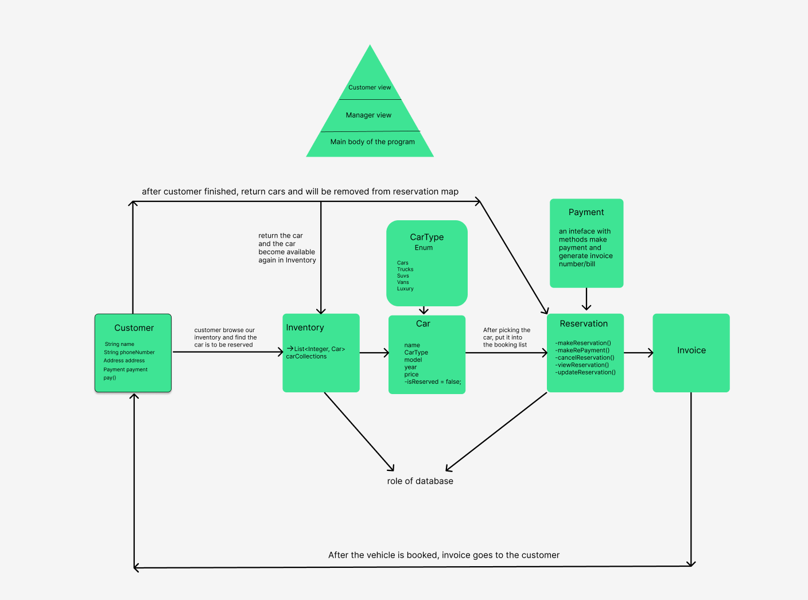
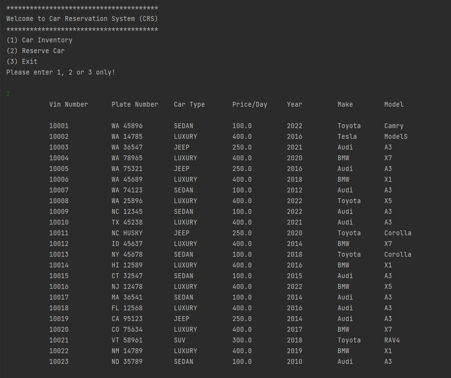
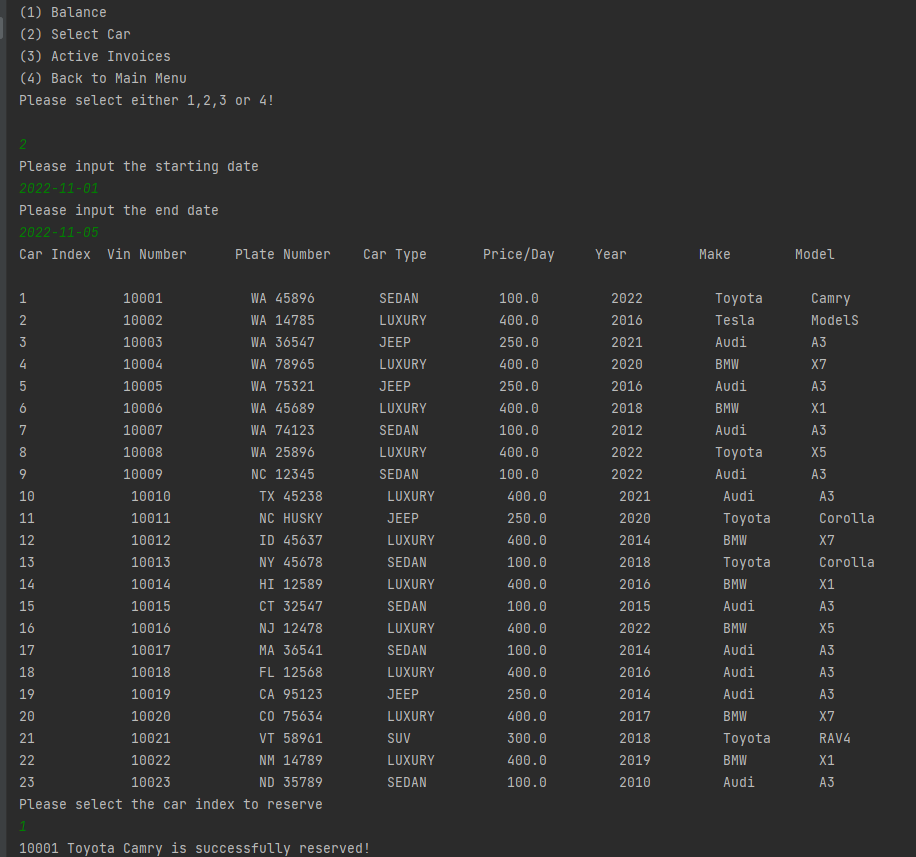
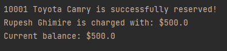
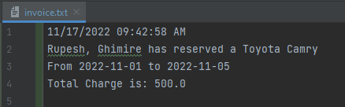
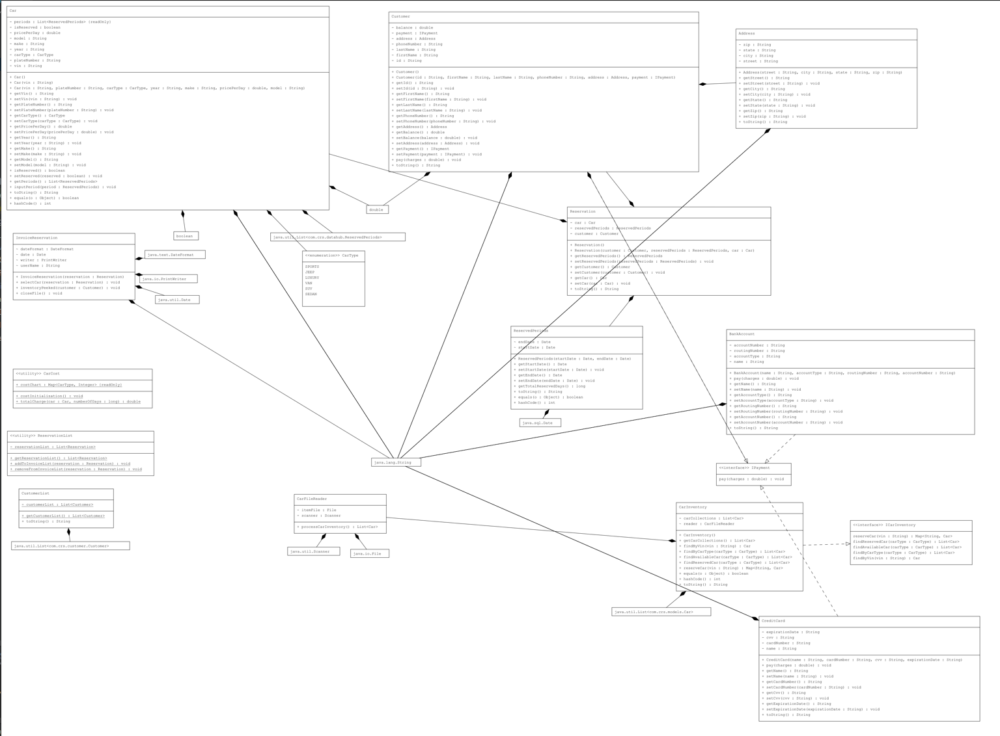

# CAR RESERVATION SYSTEM (CRS)

## Table of Contents
1. [Project Description](#Project-Description)
2. [Team Members](#Team-members-of-C.A.R)
3. [Car Reservation Process](#Car-Reservation-Process )
4. [User Stories](#User-Stories)
5. [UML Diagram](#UML-Diagram)
6. [Presentation Link](#Presentation-Link)

## Project Description 

### Using our Command-line Interface: 

- You can view our inventory of cars.
- You can book, modify, and cancel car reservations.
- You can add money to your account balance.
- An invoice will be generated after your transaction.

## Team members of C.A.R 

- Rupesh Ghimire
- Alex Aguilar
- Chongwei Ma

## Car Reservation Process 

## User Stories 

- As a user, I want to view the cars available.

- As a user, I want to reserve a car with a start and stop date.

- As a user, I should be able to make a payment for my reservation

- As a user, I want to view the invoice/bill.

## UML Diagram

## Presentation Link

Click here to download presentation slides: *[Powerpoint](https://github.com/rupeshghimirey/CarReservationSystem/tree/main/presenation)*.
